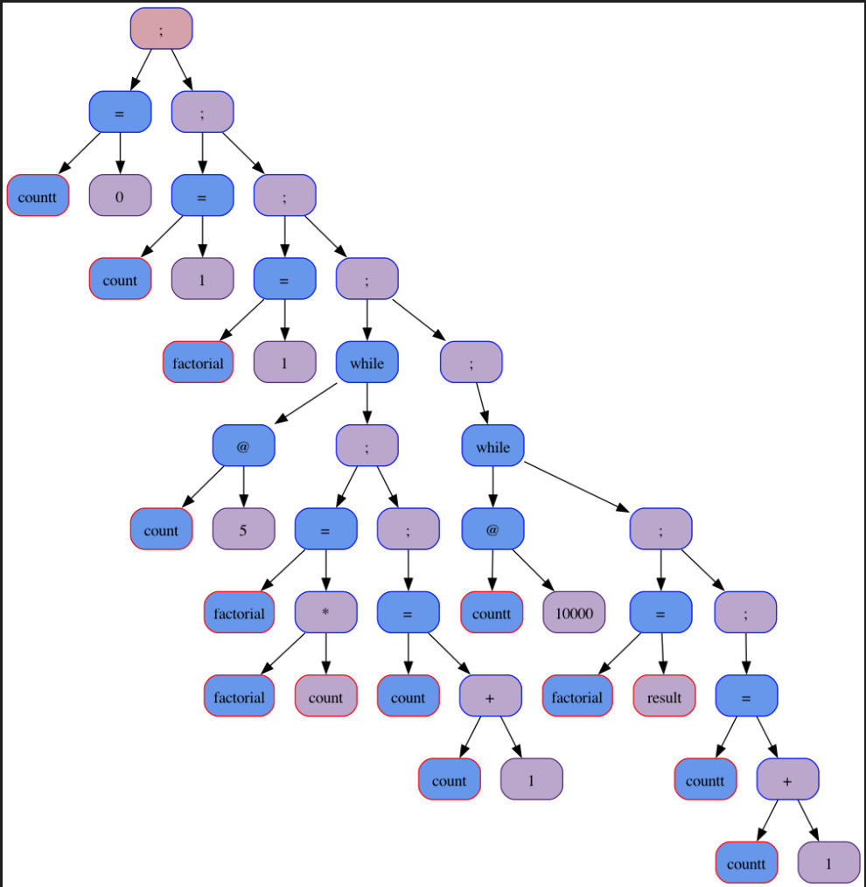

# Трансляция языка программирования в x8664

### Цель работы
Повышение производительности кода, написанного на моем языке феечек Винкс, путем прямой трансляции в ассемблер x86_64, минуя этап интерпретации на эмулированном процессоре.

Этапы:

1. Анализ исходного кода: Лексер и парсер, которые уже используются для построения AST, остаются без изменений.

Пример входного файла:

```
0 with countt winx
1 with count winx
1 with factorial winx
spell 5 < count glinksi
    factorial energy count with factorial winx
    count harmony 1 with count winx
blinksi
spell 10000 < countt glinksi
    result with factorial winx
    countt harmony 1 with countt winx
blinksi
```

1. Генерация промежуточного представления: генерируется промежуточное представление, в виде языка си

Промежуточная версия программы выше:


3. Оптимизация программы: происходят оптимизации: устранение общих подвыражений, решение простейших арифметических выражений

4. Генерация ассемблера x86_64:
    Разработка модуля (кодогенератор), который транслирует оптимизированный код в код ассемблера x86_64.

Пример получаемого кода в ассемблере для программы выше

```nasm
section .text
	global _start
_start:
	mov r9, 0
	mov rbx, 1
	mov rcx, 1
	mov r11, 1
metka_1:
	cmp rbx, 5
	jg  metka_2
	mul rbx
	add rbx, 1
	jmp metka_1
metka_2:
	mov r9, 0
metka_3:
	cmp r9, 10000
	jg  metka_4
	mov rcx, r11
	add r9, 1
	jmp metka_3
metka_4:
	mov rdi, rcx
	mov r12, 1
	call myPrintf
	mov rax, 0x2000001
	xor rdi, rdi
	syscall

%include "myPrintf.s"
```

5. Ассемблирование и компоновка: с помощью ассемблера (NASM) преобразовываем сгенерированный ассемблерный код в объектный файл. Далее с библиотеками (для macos) '-lSystem -syslibroot `xcrun --show-sdk-path`' скомпановываем объектный файл и получаем исполняемый.

### Сравнение времени работы
Сравнивать будем время работы виртуального процессора и полученный файл nasm.

Тест: будем считать факториал 5 10000000 раз

|     CPU (cекунд)    |   x86 backend (cекунд) |
|:-------------------:|:----------------------:|
|        3.405        |  0.292                 |

Следовательно, выигрыш в 11 раз
